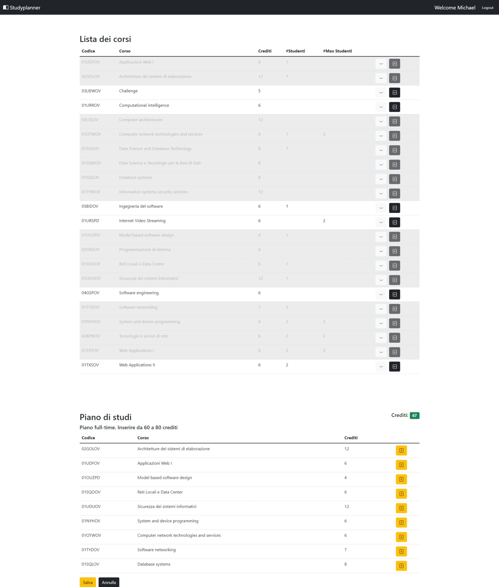

#  Exam #1: Piano di studi
## Student: s302599 BENNARDO GIUSEPPE

## React Client Application Routes

- Route `/`: home page logged-in. Se l'utente ha già creato un piano di studi è mostrato altrimenti è richiesta la creazione.
- Route `/login` pagina di login.

## API Server

- GET `/api/courses`
  - Request parameters: _none_ 
  - Response body: array di oggetti, ognuno di essi descrive un corso(codice,nome,ec...).

    ```
    [{
      "code": "01UDFOV",
      "name": "Applicazioni Web I",
      "credits": 6,
      "maxstud": null,
      "students":1,
      "prerequisite":null,
      "incomp": "01TXYOV"

    },{
      ...
      ...
    },...]
    ```
- GET `/api/studyplan`
  - Request parameters: id della sessione user
  - Response body content: array di oggeti, ognuno di essi descrive un corso appartente al piano di studi creato da un certo utente.
    ```
    [{
      "code": "01UDFOV",
      "name": "Applicazioni Web I",
      "credits": 6,
      "commitment": "full",
      "prerequisite":null
    },{
      ...
      ...
    }]
    ```
- POST `/api/studyplan`
  - request parameters: _none_
  - request body content: un oggetto contente un array con i codici dei corsi da inserire, il tipo di piano di studi(full-time o part-time) e il totale di crediti.
    ```
    {
      "planCourses":["01UDFOV","02KPNOV",...],
      "commitment":"part",
      "credits":35
    }
    ```
  - Response body content: _none_
- DELETE `/api/studyplan`
  - Request body: _none_
  - Response body content: _none_

## Database Tables

- Table `user` - contiente: id | username | password | salt | commitment
- Table `course` - contiene: code | name | credits | maxstud | prerequisite | students
- Table `incompatibility` - contiene: coursecode | incompatible
- Table `studyplan` - contiene: coursecode | userid 

## Main React Components

- `CourseTable` (in `CourseTable.js`): contiene la tabella dei corsi.Ogni riga può essere espansa per mostrare informazioni aggiuntive. Quando l'utente sta editando il piano di studi, compare il bottone di aggiunta. Se è impossibile aggiungere un corso quest'ultimo si disabilita e mostra un messaggio di errore.

- `StudyplanTable` (in `Studyplan.js`): contiene tabella dei corsi del piano di studi. 

- `Main` (in`Main.js`): componente che renderizza _StudyplanTable_ se esiste il piano di studi, oppure se non esiste, renderizza il form di creazione.

- `LoginForm` (in `login.js`): contiene form di login
- `MyNavbar` (in `navbar.js`): sempre presente, contiene il nome dell'applicativo, se l'utente è loggato mostra messaggio di benvenuto e  bottone di logout.


## Screenshot




## Users Credentials

| username | password | name |
|-------|----------|------|
| michael.jordan@polito.it | password | Michael |
| scottie.pippen@polito.it | password | Scottie |
| dennis.rodman@polito.it  | password | Dennis  |
| luc.longley@polito.it  | password | Luc  |
| ron.harper@polito.it  | password | Ron  |